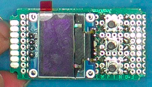

# ApplianceTimer
RP2040/Raspberry Pi Pico display/button interface designed for switching mains appliances. Designed to be as easy to use as possible.


Interface in centre can be operated by most people with one button:
* Press the button once to turn on the appliance, and leave it on for an hour
* Press the button again to add an extra hour to the timer
* Hold the button to turn the device off and cancel the timer

Pressing the two outer buttons simultaneously will enter a menu system where time/date and schedules can be set.
Pressing any invalid combination of buttons will display help messages, with instructions pointing to the appropriate buttons.

The clock supports daylight savings for any nth sunday of any month (nth and last nth Sunday of the month)

# Overview

The unit is based around a Raspberry Pi Pico. Raspberry pi pico is attached to:
  * I2C oled display
  * three buttons to GND
  * an RGB LED (common anode)
  * MOSFET
  * DS1302 clock

The unit is in turn connected to a mains relay (via MOSFET) to switch an appliance. In our application, the RPI is powered from an LM7805, which in turn is powered by a DIN rail power supply.

```text
                          +--------------+            +--------+
+--------+                |              | <--------> | MOSFET |
|        | <---- 3v ----> |              |            +--------+
|  OLED  | <---- SCL ---> |              |
|        | <---- SDA ---> |              |            +-------+
|        | <---- GND ---> |   Raspberry  | <--------> |  Btn  |---+
+--------+                |      Pi      |            +-------+   |
                          |     Pico     |                        |
+--------+                |              |            +-------+   |
|        | <---- 3v ----> |              | <--------> |  Btn  |---+
|  RGB   | <---- R -----> |    RP2040    |            +-------+   |
|        | <---- G -----> |              |                        |
|        | <---- B -----> |              |            +-------+   |
+--------+                |              | <--------> |  Btn  |---+
                          +--------------+            +-------+   |
                            ^    ^    ^                           |
                            |    |    |                           |
                           SCLK  IO   CE                          v
                            |    |    |                          GND
                            v    v    v
                          +---------------+
                          |     DS1302    |
                          +---------------+
                           ^  ^       ^  ^
                           |  |       |  |
                           v  v       v  v
                         +------+   +------+
                         | Batt |   | Xtal |
                         +------+   +------+
```

The entire unit is installed in DIN rail housing along with DIN mounted power supply and relay, and all mounted in an enclosure

# Parts
* QCE [E04P](https://www.mjselectricalsupplies.com.au/4-pole-enclosure) 4 Pole Enclosure with Din Rail<br/>Containing:
  * MEAN WELL [HDR-15-12](https://au.element14.com/mean-well/hdr-15-12/power-supply-ac-dc-12v-1-25a/dp/281563102) AC/DC DIN Rail Power Supply (PSU), ITE, 1 Output, 15 W, 12 VDC, 1.25 A
  * FINDER [22.22.9.012.4000](https://au.element14.com/finder/22-22-9-012-4000/relay-dpst-no-250vac-20a/dp/1169296) Power Relay, Non Latching, DPST-NO, 12 VDC, 20 A, 22 Series, DIN Rail
  * CAMDENBOSS [CNMB/2/2](https://au.rs-online.com/web/p/din-rail-enclosures/7495878) CAMDENBOSS Modular Enclosure Enclosure Type CNMB Series , 36 x 58 x 90mm, Polycarbonate DIN Rail Enclosure<br/>Containing
    * CAMDENBOSS [CNMB/2/TG508P](https://au.rs-online.com/web/p/enclosure-accessories/7496045) CAMDENBOSS Polycarbonate Terminal Guard Perforated for Use with CNMB DIN Rail Enclosure, 35.5 x 13.8 x 20mm
    * CAMDENBOSS [CNMB/2/PC](https://au.rs-online.com/web/p/enclosure-accessories/7495988) CAMDENBOSS Polycarbonate Cover for Use with CNMB DIN Rail Enclosure, 32 x 42 x 5mm
    * RASPBERRY-PI [RASPBERRY PI PICO](https://au.element14.com/raspberry-pi/raspberry-pi-pico/raspberry-pi-32bit-arm-cortex/dp/364333202) Raspberry Pi Pico Board, RP2040, 32 bit, ARM Cortex-M0+
    * 2x 3cm x 7cm Protoboards
    * UI Components:
      * BuyDisplay [ER-OLEDM0.96-1W-I2C](https://www.buydisplay.com/i2c-white-0-96-inch-oled-display-module-128x64-arduino-raspberry-pi) I2C White 0.96" inch OLED Display Module 128x64 Arduino,Raspberry Pi
      * SCHURTER [SCHURTER](https://au.element14.com/schurter/1301-9320-24/tactile-switch-lsh-series-top/dp/2913817) Tactile Switch, LSH, Top Actuated, Surface Mount, Round Button, 160 gf, 50mA at 12VDC 
      * BROADCOM [ASMB-MTB1-0A3A2](https://au.element14.com/broadcom-limited/asmb-mtb1-0a3a2/led-hb-rgb-0-09w-plcc-4/dp/2401106) LED, RGB, Red, Green, Blue, SMD, 2.4mm, 115 °, Round, R 20mA, G 20mA, B 20mA
      * 1x 68 ohm resistor and 2x 10 ohm resistor for RGB LED (68 ohm for red)
      * 3d printed cap for centre button.
    * Timer:
      * ANALOG DEVICES [DS1302+](https://au.element14.com/maxim-integrated-products/ds1302/ic-trickle-charge-rtc-1302-dip8/dp/2518645) Timekeeper IC, Date Time Format (Day/Date/Month/Year hh:mm:ss), 3 Wire, Serial, 2 V to 5.5 V, DIP-8
      * crystal
      * VARTA [6127601301](https://au.element14.com/varta/6127601301/battery-lithium-cr1-2aa-950mah/dp/1877571) Battery, Single Cell, 3 V, 1/2AA, Lithium Manganese Dioxide, 950 mAh, Axial Leaded, 14.75 mm
    * Power:
      * ONSEMI [NCP7805TG.](https://au.element14.com/onsemi/ncp7805tg/linear-volt-reg-fixed-1a-5v-to/dp/2534218) Linear Voltage Regulator, Fixed, 5V/1A out, TO-220-3
    * Switching
      * DIODES INC. [DMN3023L-7](https://au.element14.com/diodes-inc/dmn3023l-7/mosfet-n-ch-30v-6-2a-sot23/dp/3127331) Power MOSFET, N Channel, 30 V, 6.2 A, 0.025 ohm, SOT-23, Surface Mount
      * 100k resistor
      * 100 ohm & LED connected to gate for debugging
    * AMP - TE CONNECTIVITY [5-826947-0](https://au.element14.com/amp-te-connectivity/5-826947-0/btb-conn-header-50pos-1row-2-54mm/dp/1580058) Pin Header, Right Angle, Board-to-Board, 2.54 mm, 1 Rows, 50 Contacts, Through Hole Right Angle
    * pinsocket
    * pinheader straight
    * screw terminals

# Images


Assembled interface. Polycarbonate cover is masked and spraypainted. Holes added for buttons. 3D printed cap covers middle button. 


PCB Assembley. From Top to Bottom:
* OLED display
* PCB containing buttons and RGB LED
* Interconnect to create correct spacing
* PCB containing timer, regulator and MOSFET
* Raspberry Pi Pico


## Top Board


Front, showing OLED and buttons. RGB LED is under OLED, pointing towards buttons


Underside showing wiring


Side view showing physical construction

## Bottom Board


Underside of board, showing raspberry pi header, clock chip, SMD mosfet and LED on bottom right corner.


Clock chip, battery, and SMD Resistors (centre of board)


SMD Mosfet LED and resistor


Top side, showing crystal, connector to top board, regulator, and screw terminals


Close view of crystal and wiring
